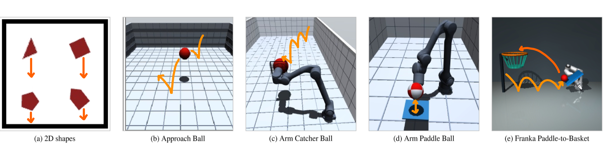

# Semigroup-JEPA

### Latent Dynamics Consistency for Zero-Shot Physics Generalization

<p align="center">
  <b>[ <a href="https://github.com/sg-jepa/sg-jepa">Code</a> |
  <a href="https://huggingface.co/datasets/sg-jepa/sg-jepa">Checkpoints</a> ]</b>
</p>

<p align="center">
  
</p>

Semigroup-JEPA is a gravity-conditioned latent world model built on
LeWorldModel. It concatenates the physical parameter with the controls and
trains the encoder and temporal predictor with a discounted autoregressive
latent rollout. SIGReg regularizes the shared latent space without a target
network.

Across two planar tasks and four 3D prediction or control tasks, the paper
compares Original LeWM, SG-GRU, SG-SSM, and DINO-WM using state probes and
diffusion-policy control. It reports 34% lower Approach Ball position error
than DINO-WM and an increase in Arm Catcher success from 9.5% to 23.3%.

## Installation

Semigroup-JEPA supports Python 3.10 to 3.12 on Linux. Training, evaluation,
and simulation require an NVIDIA CUDA GPU.

```bash
git clone https://github.com/sg-jepa/sg-jepa.git
cd sg-jepa
uv sync --extra data --extra hub
```

The reported runs used Python 3.12.13, PyTorch 2.11.0, CUDA 12.8, and B200
GPUs. The matching package list is in
[`requirements-paper-cu128.txt`](requirements-paper-cu128.txt):

```bash
uv venv --python 3.12.13 .venv-paper
uv pip sync --index-strategy unsafe-best-match \
  --python .venv-paper/bin/python requirements-paper-cu128.txt
uv pip install --python .venv-paper/bin/python --no-deps -e .
```

## Examples

[`examples/`](examples/) contains stage-by-stage GPU workflows for Square,
Franka Basket, and Arm Paddle Ball. `RUN_MODE` defaults to `smoke`; set it to
`full` for the full-size configurations.

```bash
for stage in data world-model probe evaluate; do
  RUN_MODE=smoke bash examples/square.sh "$stage"
done

for task in franka_basket arm_paddle_ball; do
  for stage in data world-model policy; do
    RUN_MODE=smoke bash "examples/${task}.sh" "$stage"
  done
  RUN_MODE=smoke bash "examples/${task}.sh" evaluate 0
done
```

The examples share outputs through `EXAMPLE_TAG` and support separate data,
checkpoint, and MuJoCo Menagerie roots. See
[`examples/README.md`](examples/README.md) for the environment variables,
stage interface, resume behavior, and Slurm launcher.

## Data

The six task IDs are `right_triangle`, `square`, `approach_ball`,
`arm_catcher_ball`, `arm_paddle_ball`, and `franka_basket`. The generators
write Lance datasets with one row per frame.

```bash
uv run python -m data_generation.generate \
  --recipe data_generation/recipes/main_text.yaml \
  --task approach_ball \
  --split train \
  --output /path/to/approach_train
```

See [`data_generation/README.md`](data_generation/README.md) for recipes and
robot assets, and [`data/README.md`](data/README.md) for the dataset schema.

## Training and evaluation

| Entry point | Purpose |
|---|---|
| `train.py` | Train Original LeWM, SG-GRU, SG-SSM, or DINO-WM |
| `train_probe.py` | Train the MLP state probe, including planar symmetry targets |
| `train_policy.py` | Train a diffusion policy on a frozen encoder |
| `evaluate_prediction.py` | Evaluate probe rollouts |
| `evaluate_control.py` | Run closed-loop Franka, Paddle, or Catcher control |

Model configurations live in [`configs/`](configs/); the example policy
configs are under [`examples/configs/`](examples/configs/). Use `--help` on an
entry point for its direct CLI. The trainers support validation, checkpoints,
and resume. Policy training filters successful demonstrations and uses a
warmup and cosine learning-rate schedule with EMA validation. Evaluation
writes JSON and CSV reports without plotting.

DINO-WM uses a frozen DINOv2 ViT-S/14. Provision the pinned source and weights
once:

```bash
uv run python -c \
  'from sg_jepa.baselines import provision_dinov2_artifact; provision_dinov2_artifact("artifacts/dinov2-vits14")'
```

[`notebooks/approach_rollout.ipynb`](notebooks/approach_rollout.ipynb) shows
how to load an Approach model and probe and inspect rollout metrics.

## Checkpoints

Artifact IDs and revisions are recorded in
[`sg_jepa/pretrained.json`](sg_jepa/pretrained.json). The files are organized
under one Hugging Face dataset repository at
[`sg-jepa/sg-jepa`](https://huggingface.co/datasets/sg-jepa/sg-jepa). This
repository contains checkpoints, not trajectory data. Downloads are pinned to
commit `a0345d0101f99251029fdbe7991b73c5ff763328`. DINOv2 is referenced from its
pinned upstream revision rather than mirrored here. The upload contains eight
inference-only safetensors with JSON sidecars; optimizer and RNG state are
excluded.

```python
from sg_jepa.hub import load_policy, load_pretrained, load_probe

model = load_pretrained("square-sg-jepa-gru", device="cuda")
probe = load_probe("square-sg-jepa-gru", device="cuda")
policy = load_policy("franka-sg-jepa-gru", device="cuda")
```

## Citation

```bibtex
@software{semigroup_jepa,
  title  = {Semigroup-JEPA: Latent Dynamics Consistency for Zero-Shot Physics Generalization},
  author = {{Semigroup-JEPA Contributors}},
  year   = {2026},
  url    = {https://github.com/sg-jepa/sg-jepa}
}
```

## License

Project-owned source is released under the [MIT License](LICENSE). DINO-WM,
stable-pretraining, DINOv2, and MuJoCo Menagerie attribution and terms are in
[`THIRD_PARTY_NOTICES.md`](THIRD_PARTY_NOTICES.md).
